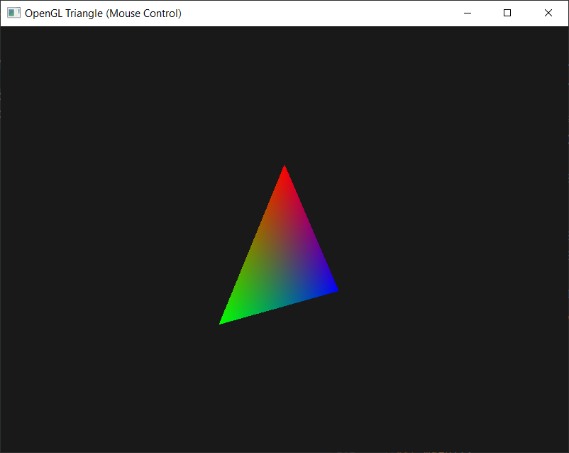

# Python OpenGL 交互式三角形渲染程序
## 作业说明
这是一个基于 **Python PyOpenGL** 库开发的基础 3D 图形渲染程序，借助 GLUT（窗口与交互管理）、GLU（辅助工具库）实现了带颜色渐变的三角形绘制，并支持鼠标交互式视角控制，是入门 OpenGL 基础图形渲染与视角变换的典型示例。

## 功能特性
1.  **交互式视角控制**：支持两种核心视角操作，操作流畅且带参数限制，避免异常视角
    -  鼠标左键拖动：实现模型绕 X 轴（垂直拖动）、Y 轴（水平拖动）旋转
    -  鼠标滚轮滚动：实现视角缩放，可放大/缩小查看三角形细节
2.  **基础 3D 渲染特性**
    -  颜色渐变三角形：三个顶点分别设置红、绿、蓝三色，自动实现平滑颜色插值
    -  双缓冲渲染：避免画面闪烁，保证渲染效果流畅
    -  深度测试：防止图形重叠时出现渲染顺序错误，确保 3D 视觉合理性
3.  **窗口自适应**：支持窗口大小调整，自动更新投影矩阵，保持渲染效果不变形
4.  **参数安全限制**
    -  旋转限制：绕 X 轴旋转角度限制在 [-90, 90] 度，避免视角翻转
    -  缩放限制：缩放因子限制在 [0.1, 5.0] 范围内，避免过度缩放导致图形消失或失真

## 环境要求
### 基础环境
- Python 3.6 及以上版本（兼容 Python 3.7/3.8/3.9/3.10）
### 核心依赖库
- PyOpenGL：Python 绑定的 OpenGL 接口，提供 GL/GLUT/GLU 相关函数
- PyOpenGL-accelerate：PyOpenGL 加速库，提升渲染性能（可选，推荐安装）

### 依赖安装命令
打开命令行终端，执行以下命令安装依赖：
```bash
# 完整安装（推荐，包含加速库）
pip install PyOpenGL PyOpenGL-accelerate

# 基础安装（仅核心库）
pip install PyOpenGL
```

## 使用方法
### 1. 代码保存
将程序代码保存为 `.py` 格式文件（例如 `opengl_triangle.py`）

### 2. 运行程序
打开命令行终端，切换到代码文件所在目录，执行以下命令运行：
```bash
python Triangle.py
```

### 3. 交互操作指南
| 操作方式 | 功能说明 | 补充说明 |
|----------|----------|----------|
| 鼠标左键按住 + 拖动 | 旋转视角 | 水平拖动：绕 Y 轴旋转；垂直拖动：绕 X 轴旋转 |
| 鼠标滚轮向上滚动 | 放大视角 | 缩放因子乘以 1.1，拉近相机与三角形的距离 |
| 鼠标滚轮向下滚动 | 缩小视角 | 缩放因子除以 1.1，拉远相机与三角形的距离 |
| 拖动窗口边框/最大化窗口 | 自适应调整画面 | 自动更新投影矩阵，三角形比例保持不变 |
| 关闭窗口（点击右上角×） | 退出程序 | 正常终止 GLUT 主循环 |

## 项目结构
```
├── Triangle.py  # 主程序代码（包含所有逻辑与回调函数）
├── a.jpg                # 效果展示图片（与代码文件同文件夹）
└── README.md            # 项目说明文档
```

## 核心代码说明
1.  **全局变量**：维护视角控制的核心参数，统一管理便于回调函数访问和修改
    - `rx`/`ry`：绕 X 轴/Y 轴的旋转角度
    - `last_x`/`last_y`：鼠标上次拖动的坐标，用于计算偏移量
    - `mouse_down`：标记鼠标左键是否按下，控制旋转功能开关
    - `zoom`：缩放因子，控制相机与模型的距离
2.  **鼠标交互回调函数**
    - `mouse_click`：处理鼠标左键按下/抬起事件，更新鼠标状态标记与初始坐标
    - `mouse_motion`：处理鼠标拖动事件，计算偏移量并更新旋转角度，限制 X 轴旋转范围
    - `mouse_wheel`：处理鼠标滚轮事件，更新缩放因子并限制缩放范围
3.  **窗口与投影回调函数**
    - `reshape`：窗口大小调整时触发，更新视口大小与透视投影矩阵，保证画面不变形
4.  **核心渲染函数**
    - `render`：程序渲染入口，完成缓冲区清空、矩阵重置、相机设置、旋转变换与三角形绘制
    - 关键流程：清空缓冲区 → 设置相机位置 → 应用旋转变换 → 绘制颜色渐变三角形 → 交换双缓冲区
5.  **主函数 `main`**
    - 初始化 GLUT 环境，设置显示模式（双缓冲、RGB 颜色、深度测试）
    - 创建窗口并设置背景色，注册各类回调函数
    - 启用深度测试，启动 GLUT 主循环（阻塞运行，直到窗口关闭）

## 效果展示
<!-- 此处插入效果展示图片，图片文件名为 a.jpg，与本README同文件夹 -->


## 注意事项
1.  **安装失败排查**
    - 若提示 `pip` 命令不存在：检查 Python 是否添加到系统环境变量
    - 若安装缓慢/超时：切换国内 PyPI 镜像源（如清华源、阿里云源）重新安装
      ```bash
      # 临时使用清华源安装
      pip install -i https://pypi.tuna.tsinghua.edu.cn/simple PyOpenGL PyOpenGL-accelerate
      ```
2.  **窗口标题说明**：代码中窗口标题使用 `b"OpenGL Triangle (Mouse Control)"`（字节串格式），兼容 Python 3 所有版本，若需显示中文，可根据系统编码调整为 Unicode 字符串
3.  **参数自定义调整**
    -  旋转灵敏度：修改 `mouse_motion` 函数中的 `0.5` 系数，数值越大旋转越灵敏
    -  缩放灵敏度：修改 `mouse_wheel` 函数中的 `1.1` 系数，数值越大缩放越灵敏
    -  旋转范围：修改 `mouse_motion` 函数中的 `-90`/`90`，调整 X 轴旋转的上下限
    -  缩放范围：修改 `mouse_wheel` 函数中的 `0.1`/`5.0`，调整缩放因子的上下限
4.  **运行报错排查**
    -  若提示 `no module named 'OpenGL'`：确认 PyOpenGL 已正确安装，或切换 Python 环境（避免多版本 Python 冲突）
    -  若画面无三角形：检查深度测试是否启用（代码中已默认启用，无需额外修改）
    -  若窗口闪退：简化代码逐步排查，或更新 PyOpenGL 至最新版本
