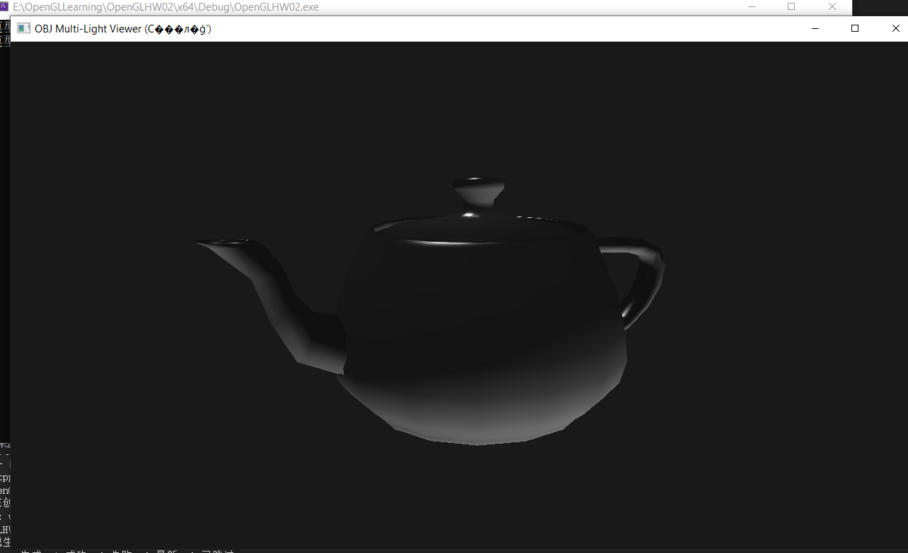

# OpenGL OBJ 模型多光源查看器
## 项目介绍
这是一个基于 **OpenGL 3.3 Core Profile** 开发的 OBJ 模型查看工具，集成了 GLFW（窗口管理）、Glad（OpenGL 函数加载）、Assimp（模型导入）、GLM（图形数学库）四大核心依赖，实现了模型的高质量渲染与灵活的交互控制，支持两种视图模式切换和多光源光照效果展示。

## 功能特性
1.  **双视图模式切换**：通过 `C` 键切换两种核心视图模式
    - 模型中心模式：围绕模型进行旋转、缩放、平移操作，适合精细查看模型细节
    - 视点中心模式：第一人称场景漫游，适合在模型场景中自由移动
2.  **OBJ 模型加载**：支持标准 OBJ 格式模型导入，自动计算模型中心与包围球半径
3.  **多光源渲染**：配置 1 个平行光 + 4 个点光源，实现真实的漫反射、镜面反射光照效果
4.  **灵活交互控制**：支持鼠标旋转、滚轮缩放、键盘平移/漫游，操作流畅自然
5.  **核心 OpenGL 特性**：启用深度测试，避免模型渲染遮挡问题，保证 3D 视觉效果
6.  **模块化设计**：封装 Shader、Mesh、Model 类，代码结构清晰，易于扩展和维护

## 环境要求
### 依赖库
- GLFW 3.x：窗口创建与输入事件处理
- Glad：OpenGL 3.3 核心函数加载
- Assimp 5.x：模型文件解析与网格数据提取
- GLM 0.9.9+：矩阵变换、向量运算等图形数学操作
### 编译环境
- 操作系统：Windows（代码中使用 Windows 绝对路径，可适配 Linux/MacOS 路径修改）
- 编译工具：Visual Studio 2019 及以上 / CMake 3.10 及以上
- 显卡支持：支持 OpenGL 3.3 及以上版本

## 使用方法
### 1. 环境配置
1.  下载并配置上述四大依赖库，在项目中添加对应的**包含目录**、**库目录**和**附加依赖项**
2.  确保 Glad 已生成对应 OpenGL 3.3 Core 的加载文件，并添加到项目中

### 2. 路径修改
修改代码中着色器与模型的绝对路径，替换为你本地的文件路径：
```cpp
// 着色器路径修改
Shader lightingShader("你的本地路径/lighting.vs", "你的本地路径/lighting.fs");
// 模型路径修改
model = new Model("你的本地路径/teapot.obj");
```

### 3. 编译运行
1.  编译项目并运行可执行文件
2.  程序启动后自动加载模型，默认进入「模型中心模式」

### 4. 交互操作指南
| 操作方式 | 功能说明 | 模型中心模式 | 视点中心模式 |
|----------|----------|--------------|--------------|
| 鼠标移动 | 旋转视角 | 围绕模型旋转 | 第一人称视线旋转 |
| 鼠标滚轮 | 缩放视图 | 调整视点与模型的距离 | 无效果 |
| W 键 | 向上/向前移动 | 模型向上平移 | 相机向前漫游 |
| S 键 | 向下/向后移动 | 模型向下平移 | 相机向后漫游 |
| A 键 | 向左移动 | 模型向左平移 | 相机向左漫游 |
| D 键 | 向右移动 | 模型向右平移 | 相机向右漫游 |
| 空格键 | 向上移动 | 无效果 | 相机向上漂浮 |
| 左Shift键 | 向下移动 | 无效果 | 相机向下下降 |
| C 键 | 模式切换 | 切换至视点中心模式 | 切换至模型中心模式 |
| ESC 键 | 退出程序 | 支持 | 支持 |

## 项目结构
```
├── 源代码文件.cpp       # 主程序代码（包含所有类与逻辑）
├── lighting.vs          # 顶点着色器文件
├── lighting.fs          # 片段着色器文件
├── Resources/           # 模型资源目录
│   └── teapot.obj       # 示例OBJ模型
├── a.jpg                # 效果展示图片（同文件夹下）
└── README.md            # 项目说明文档
```

## 核心代码说明
1.  **Shader 类**：封装着色器的读取、编译、链接与统一变量设置，简化着色器使用流程
2.  **Mesh 类**：封装网格的顶点缓冲区、索引缓冲区与VAO配置，实现网格绘制功能
3.  **Model 类**：通过 Assimp 加载 OBJ 模型，递归处理模型节点与网格，自动计算模型中心和包围球
4.  **视图模式逻辑**：通过 `ViewMode` 枚举区分两种模式，分别维护各自的相机参数与交互逻辑
5.  **多光源配置**：在着色器中配置平行光与点光源参数，实现真实的光照渲染效果
6.  **交互回调函数**：实现鼠标移动、滚轮滚动、窗口大小调整的回调处理，保证交互响应

## 效果展示

